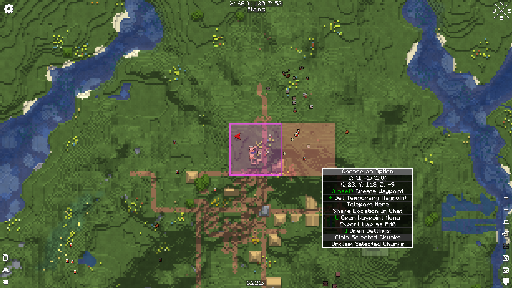
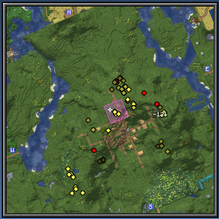

# Xaero's Factions

## Setup

This mod is currently only supported for fabric 1.21.11.  
Download from [releases](https://github.com/H3LiiiX/xaeros-factions/releases) and place in your client and server mods folder.  

Ensure you also have these mods installed:  
- [Factions](https://modrinth.com/mod/factions) (Server)
- [Xaero's Minimap](https://modrinth.com/mod/xaeros-minimap) (Client)
- [Xaero's World Map](https://modrinth.com/mod/xaeros-world-map)) (Client)

That's it!  

